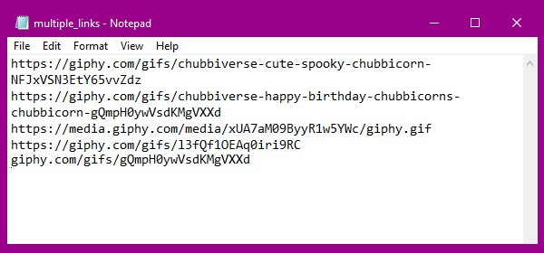

### instructions (command line interface)
#### for one gif
- `enter/paste giphy url`
- `press ENTER and wait for the gif to download`
- `check the gifs folder for the gif`
#### for mass gifs
- `put all the urls in the mutliple_links.txt file (seperate these with a new line, see image)`
  
</img>
- `save the file`
- `start the program`
- `type 'f' and press enter (case insensitive)`
- `wait for the gifs to download`
- `check the gifs folder for the gifs`

#### credits
- `all credits go to dennzlak ( me )`
